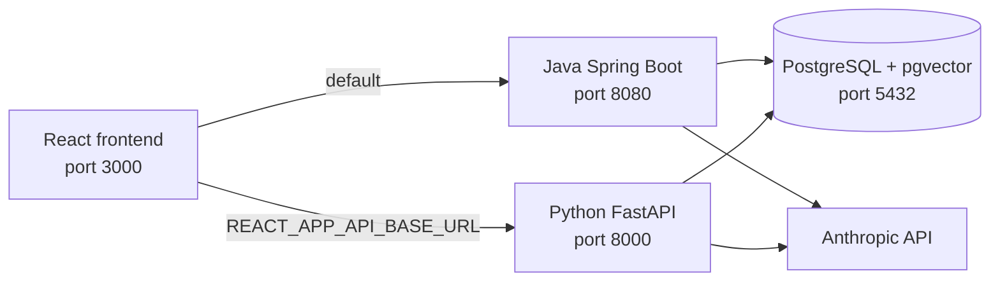

# AI Cookbook Requirements

**Purpose**: This document records the current functional and operational requirements for The AI Cookbook. It replaces the earlier Python migration proposal. The application now has two endpoint-compatible backends, both using Anthropic for chat generation and PostgreSQL/pgvector for persistence and semantic search.

## 1. System Overview

The AI Cookbook is a Retrieval-Augmented Generation (RAG) application with document ingestion, semantic search, persistent conversation memory, tool-assisted chat, structured extraction, product search, and a chunking analysis lab.



### 1.1 Deployable Services

| Service | Technology | Port | Responsibility |
|---|---|---:|---|
| Java backend | Spring Boot 3.5 + Spring AI 1.1.4 | 8080 | Original backend implementation |
| Python backend | FastAPI | 8000 | Endpoint-compatible backend implementation |
| Frontend | React 18 / Create React App | 3000 | User interface |
| Data plane | PostgreSQL 17 + pgvector | 5432 | Relational data and vector search |

Both backend implementations share the same PostgreSQL schema and vector tables. The Java backend is the frontend default. Set `REACT_APP_API_BASE_URL=http://localhost:8000` before starting or building React to use the Python backend.

## 2. Provider and Configuration Requirements

### 2.1 Anthropic Only

- Both current backend implementations use Anthropic for chat generation.
- `ANTHROPIC_API_KEY` is required to invoke chat, RAG, memory, tool, and structured-output features.
- The Java backend configures `spring.ai.model.chat: anthropic` in `application.yaml`.
- The Python setting `AI_CHAT_PROVIDER` accepts only `anthropic`.
- Ollama is not a supported runtime, dependency, configuration option, or deployment requirement.

### 2.2 Python Environment

The Python backend uses Pydantic `Settings` and reads `.env` values plus process environment variables.

| Variable | Default | Purpose |
|---|---|---|
| `APP_HOST` | `0.0.0.0` | Bind address |
| `APP_PORT` | `8000` | Backend port |
| `APP_CORS_ORIGINS` | `http://localhost:3000` | Comma-separated allowed browser origins |
| `APP_MAX_UPLOAD_MB` | `50` | Upload limit |
| `AI_CHAT_PROVIDER` | `anthropic` | Must remain `anthropic` |
| `ANTHROPIC_API_KEY` | empty | Anthropic credential |
| `ANTHROPIC_MODEL` | `claude-sonnet-4-6` | Anthropic model |
| `ANTHROPIC_TEMPERATURE` | `0.7` | Default generation temperature |
| `DB_HOST` | `localhost` | PostgreSQL host |
| `DB_PORT` | `5432` | PostgreSQL port |
| `DB_NAME` | `ragdb` | Database name |
| `DB_USER` | `postgres` | Database user |
| `DB_PASSWORD` | `postgres` | Database password |
| `RAG_MODE` | `soft` | Default RAG behavior |
| `RAG_TOP_K` | `5` | Default retrieved chunks |
| `RAG_SIMILARITY_THRESHOLD` | `0.0` | Default similarity cutoff |
| `EMBEDDING_DIMENSIONS` | `384` | pgvector dimension contract |

### 2.3 Local Development

```bash
# Shared PostgreSQL/pgvector data plane
docker compose up pgvector -d

# Java backend
cd ai-cookbook-java-backend
ANTHROPIC_API_KEY=sk-ant-... ./gradlew bootRun

# Python backend
cd ai-cookbook-backend
python3 -m venv .venv
source .venv/bin/activate
python3 -m pip install -r requirements.txt
ANTHROPIC_API_KEY=sk-ant-... python3 -m uvicorn app.main:app --reload --host 0.0.0.0 --port 8000

# Frontend against Python
cd ai-cookbook-frontend
REACT_APP_API_BASE_URL=http://localhost:8000 npm start
```

To start all services through Compose:

```bash
ANTHROPIC_API_KEY=sk-ant-... docker compose up --build
```

## 3. Functional Requirements

### 3.1 Frontend Tabs

| Tab | Component | Primary API surface |
|---|---|---|
| Chat | `ChatBot.js` | `GET /ai/chat/string` |
| Documents | `DocumentUpload.js` | `/documents` |
| Vector Search | `VectorSearch.js` | `/documents/verify` and `/documents/verify/search` |
| RAG Chat | `RAGChatbot.js` | `GET /rag/ai/chat/string/client` |
| RAG + Memory | `RAGChatbotWithMemory.js` | `/rag/memory/*` |
| Tool Agent | `ToolAgent.js` | `GET /tool/ai/chat/string` |
| Structured Output | `StructuredOutput.js` | `GET /structured/extract` |
| Product Search | `ProductSearch.js` | `/products/*` |
| Chunking Lab | `ChunkingLab.js` | `POST /chunking/analyze` |

All frontend components resolve the backend URL as:

```javascript
process.env.REACT_APP_API_BASE_URL || 'http://localhost:8080'
```

### 3.2 Direct Chat

`GET /ai/chat/string?message={message}` returns a `text/event-stream` response with the Anthropic answer. Direct chat does not use document context.

### 3.3 RAG Chat

`GET /rag/ai/chat/string/client` provides document-augmented chat. It accepts:

| Parameter | Default | Rule |
|---|---:|---|
| `message` | required | User question |
| `topK` | `5` | Integer from 1 to 50 |
| `similarityThreshold` | `0.0` | Number from 0.0 to 1.0 |
| `mode` | `soft` | `soft` allows model knowledge fallback; `strict` requires matching document context |
| `temperature` | `0.7` | Number from 0.0 to 1.0 |
| `maxTokens` | `1000` | Integer from 64 to 4096 |

`GET /rag/context` exposes the generated context, strict-mode short-circuit flag, and source metadata. `GET /rag/search` returns raw document similarity results.

### 3.4 RAG With Conversation Memory

The memory feature scopes persisted history by a browser-generated `conversationId`.

| Method | Path | Purpose |
|---|---|---|
| GET | `/rag/memory/ai/chat/string/client` | Streaming RAG answer and persisted turn |
| POST | `/rag/memory/ai/chat/json/client` | JSON RAG answer including sources and context-use metadata |
| GET | `/rag/memory/conversations` | Recent conversation summaries |
| GET | `/rag/memory/conversations/{conversationId}/messages` | Ordered conversation messages |
| DELETE | `/rag/memory/ai/chat/conversation/{conversationId}` | Delete a conversation |

The Python service stores `USER` and `ASSISTANT` messages in `conversation_messages` with monotonically increasing `message_index` values. It uses the recent conversation window when generating a new turn.

### 3.5 Documents and Vector Search

Documents support PDF, TXT, and DOCX uploads up to `APP_MAX_UPLOAD_MB` (50 MB by default).

| Method | Path | Purpose |
|---|---|---|
| GET | `/documents` | List document metadata |
| POST | `/documents/upload` | Extract, chunk, embed, and store a document |
| DELETE | `/documents/{id}` | Remove metadata and associated document vectors |
| GET | `/documents/verify` | Vector-store health and indexed chunk inspection |
| GET | `/documents/verify/search` | Raw document similarity search |

Document ingestion persists metadata in `document_metadata` and chunk vectors in `vector_store`. Deletion must remove data from both locations.

### 3.6 Product Search

Product data is isolated from document vectors.

| Method | Path | Purpose |
|---|---|---|
| GET | `/products` | List indexed products |
| POST | `/products/upload` | Import an XLSX catalog and create product embeddings |
| GET | `/products/search` | Semantic product search |
| GET | `/products/verify` | Product vector-store verification |
| DELETE | `/products/{id}` | Remove a product and its product vector |

The XLSX header contract is:

```text
ProductID | Name | Category | Brand | Description | Price | ImageUrl | Rating | StockCount
```

Products are stored in `product`; their embeddings are stored separately in `product_vector_store`.

### 3.7 Tool Agent and Structured Output

| Method | Path | Requirement |
|---|---|---|
| GET | `/tool/ai/chat/string` | Use Anthropic tool-capable chat with calculator, current date/time, and mock weather tools |
| GET | `/structured/extract` | Return typed entity extraction with people, organizations, locations, dates, and topics |

### 3.8 Chunking Lab

`POST /chunking/analyze` accepts a file and multipart fields:

| Field | Default | Constraint |
|---|---:|---|
| `strategy` | `RECURSIVE` | Chunking strategy selector |
| `chunkSize` | `1000` | 64 through 5000 |
| `overlap` | `100` | 0 through 4999 |

The endpoint analyzes chunks without persisting the upload. It reports chunk counts, character counts, estimated tokens, aggregate statistics, and previews.

## 4. Python Backend Architecture

```text
ai-cookbook-backend/
├── app/
│   ├── config.py          # Pydantic settings
│   ├── db.py              # SQLAlchemy sessions and database checks
│   ├── main.py            # FastAPI lifespan, CORS, middleware, router registration
│   ├── middleware/        # Upload size enforcement
│   ├── models/            # SQLAlchemy persistence models
│   ├── providers/         # ChatProvider protocol and Anthropic implementation
│   ├── repositories/      # Persistence adapters
│   ├── routers/           # HTTP endpoint definitions
│   ├── schemas/           # Request and response types
│   ├── services/          # RAG, ingestion, memory, products, embeddings
│   └── vector/            # pgvector access helpers
├── alembic/               # Python schema migration history
├── requirements.txt       # Pinned runtime and development dependencies
└── Dockerfile
```

The FastAPI lifespan runs database, pgvector-extension, and chat-provider checks. `GET /health` is a liveness endpoint; `GET /ready` returns readiness status and reports failed startup checks with HTTP 503.

The application permits configured origins and supports `GET`, `POST`, `PUT`, `DELETE`, and `PATCH`. The default browser origin is `http://localhost:3000`.

## 5. Data and Migration Requirements

### 5.1 Shared Schema

| Table | Purpose |
|---|---|
| `vector_store` | Document chunks with 384-dimensional embeddings |
| `document_metadata` | Uploaded-document metadata and chunk count |
| `conversation_messages` | Ordered user and assistant conversation history |
| `product` | Relational product catalog |
| `product_vector_store` | Product embeddings separate from document embeddings |

Vector tables use HNSW indexes with cosine distance. PostgreSQL must have the `vector` and `hstore` extensions enabled.

### 5.2 Alembic History

The Python backend uses Alembic migrations under `ai-cookbook-backend/alembic/versions`:

| Revision | Equivalent shared schema capability |
|---|---|
| `0001_init_schema` | pgvector extensions, `vector_store`, `document_metadata`, document HNSW index |
| `0002_add_conversation_memory` | `conversation_messages` and its conversation/order index |
| `0003_add_product_catalog` | `product`, `product_vector_store`, catalog indexes, product HNSW index |

Run Python migrations from `ai-cookbook-backend/`:

```bash
python -m alembic current
python -m alembic upgrade head
python -m alembic history
```

The Java backend has corresponding Flyway migrations. Because both services share a schema, database changes must be implemented as compatible parity migrations. Do not create conflicting definitions for the same table or index.

## 6. Dependencies

The Python backend uses pinned dependencies rather than LangChain. The relevant runtime dependencies include FastAPI, Uvicorn, Pydantic Settings, SQLAlchemy, psycopg, pgvector, Alembic, the Anthropic SDK, PyPDF, python-docx, and openpyxl.

Embeddings are 384-dimensional and provider-independent. Java uses local ONNX `all-MiniLM-L6-v2`; Python uses its embedding service and vector access layer. Both must preserve the shared pgvector dimension contract.

## 7. Acceptance Criteria

- [ ] Java and Python backends start against the shared PostgreSQL/pgvector schema using `ANTHROPIC_API_KEY`.
- [ ] The React frontend defaults to Java at `http://localhost:8080` and targets Python at `http://localhost:8000` when `REACT_APP_API_BASE_URL` is set.
- [ ] The Python service reports successful liveness through `/health` and readiness through `/ready` when PostgreSQL, pgvector, and Anthropic provider initialization succeed.
- [ ] Chat, RAG, RAG memory, documents, vector search, tools, structured extraction, products, and chunking analysis remain endpoint-compatible with the frontend.
- [ ] Strict RAG short-circuits when no relevant document context is found; soft RAG can use general knowledge when no context is found.
- [ ] Document and product delete operations remove both relational rows and associated vector rows.
- [ ] All vector embeddings remain 384-dimensional.
- [ ] The Python Alembic history and Java Flyway history remain schema-compatible.
- [ ] No Ollama runtime support, configuration, or dependencies are introduced without an explicit product decision.
